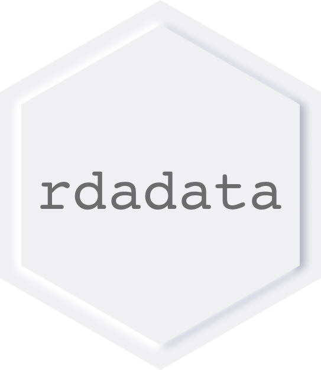
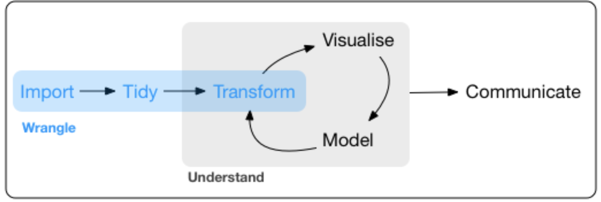

<!-- README.md is generated from README.Rmd. Please edit that file -->

```{r, include = FALSE}
knitr::opts_chunk$set(
  collapse = TRUE,
  comment = "#>",
  out.width = "100%"
)
```

# rdadata

## Objective

The **rdadata** package provides the rich functionality of [DaData REST API](https://dadata.ru/api/) to R users, without the need to write functional queries to each method. We did it for you.

In this way, users benefit from the best features of both platforms. More specifically, the package is a wrapper around [DaData REST API](https://dadata.ru/api/), allowing users to easily integrate with DaData methods.

<figure>
  
  <figcaption><a href="https://r4ds.had.co.nz/"><i>Source: R For Data Science - Hadley Wickham</i></a></figcaption>
</figure>


The focus of this package lies in the following workflow aspects:

- __Import__
- __Tidy__

Hence, for easy transformation and manipulation, main functions, related with getting DaData returns a `tibble` with **tidy data**, following main rules where each row is a single observation of an **issue** or a **project**, each column is a variable and each value must have its own cell. Thus, it integrates well with `dplyr` and tidy paradigm. This also allows for an easy integration with tabular data, but if it necessary, you may manipulate with raw JSON, saved as nested list.


## Installation


You can install the latest release of this package from [Github](https://github.com/3davinci/rdadata) with the following commands in `R`:

```{r, eval=FALSE} 
if (!require("devtools")) install.packages("devtools")
devtools::install_github("3davinci/3davinci")
```

## Example

This is a basic example which shows you how to solve a common problem:

```{r example}
library(rdadata)
## basic example code
```

# TO DO
Описать примеры использования, как можно больше сложных примеров.
